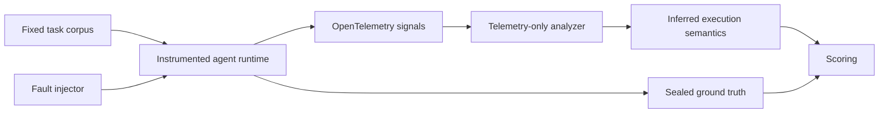

# Experiment Plan

## 1. Research objective

### Primary question

How much agent execution semantics can be reconstructed from runtime telemetry?

More specifically:

> Can OpenTelemetry reconstruct the execution behavior of an AI agent well enough to identify inefficient or failed reasoning paths without instrumenting every business-logic step manually?

### Follow-up question

Can observability become a useful feedback signal for agent runtimes?

The project treats telemetry as machine-readable evidence. It will measure whether an independent analyzer can recover operational facts about an agent run, not whether telemetry exposes private chain-of-thought.

## 2. Scope and terminology

For this study, **execution semantics** means externally observable operational structure:

- which model, tool, retrieval, and agent operations occurred;
- their ordering and parent-child relationships;
- latency, token use, errors, and retry behavior;
- whether an operation succeeded, failed, or recovered;
- repeated, unusually deep, or unusually expensive execution patterns.

Execution semantics does **not** include latent reasoning, unrecorded intent, or a complete explanation of why a model selected an action. Prompt and response content will be disabled by default. Correctness will require a task evaluator; traces alone cannot establish semantic correctness.

## 3. Claims to test

### H1 — Structural reconstruction

Boundary-level spans are sufficient to reconstruct the ordered model/tool operation graph with high fidelity.

### H2 — Failure-path detection

Errors, status, timing, and repeated operation signatures are sufficient to identify injected tool failures and retry loops.

### H3 — Inefficiency detection

Topology plus resource attributes are sufficient to distinguish redundant tool use, abnormal depth, and expensive reasoning paths from healthy baselines.

### H4 — Instrumentation tradeoff

Agent-, model-, and tool-boundary instrumentation recovers most actionable execution semantics without adding spans to each business-logic branch.

### H5 — Feedback viability

Some telemetry-derived signals are stable and timely enough to support bounded runtime actions such as retry-budget reduction, loop termination, or fallback routing.

## 4. Study design

The study will use a controlled repeated-measures design. Every task instance will be run in a baseline condition and in each applicable fault condition. Inputs, tool fixtures, model configuration, seeds, retry policy, and environment will remain fixed within a comparison block.

The analyzer will receive only exported telemetry. Ground-truth execution logs and scenario labels will be stored separately and used only during scoring.



### Experimental unit

One agent run of one fixed task under one condition and one seed.

### Initial task corpus

Start with deterministic or fixture-backed tasks whose expected outcomes and legal tool paths are known:

1. single-tool calculation;
2. retrieve-then-summarize;
3. two-tool comparison;
4. conditional tool routing;
5. bounded multi-step planning.

Use at least 10 task instances per task family. Run at least 30 repetitions per task-condition pair when timing distributions are part of the analysis. A pilot phase will estimate variance before final sample sizes are locked.

### Two-phase execution strategy

**Phase A: deterministic runtime.** Use a scripted model adapter and fixture-backed tools. This validates instrumentation, fault injection, reconstruction, and scoring without provider variance.

**Phase B: real model runtime.** Repeat a selected subset with a pinned model snapshot where available, fixed generation settings, and recorded provider metadata. This measures how the approach survives nondeterminism and real network behavior.

## 5. Conditions and failure modes

Each condition must preserve the task input and expected outcome while changing only the injected runtime behavior.

| Condition | Injection | Expected observable signature |
| --- | --- | --- |
| Baseline | No injected fault | Short valid topology, no errors, expected resource range |
| Transient tool failure | Fail the first matching tool call | Error span followed by a successful recovery path |
| Retry loop | Repeatedly fail or return retryable status | Repeated operation signature, repeated errors, growing latency/depth |
| Redundant tool use | Repeat a successful call with identical normalized arguments | Duplicate successful tool signatures with no new dependency |
| Expensive reasoning path | Add unnecessary model/reflection turns | Elevated model-call count, token use, and critical-path latency |
| Tool timeout | Delay a selected tool beyond its deadline | Long tool span, timeout error, cancellation or fallback edge |
| Malformed tool result | Return schema-invalid output | Successful transport followed by validation error/recovery |
| Abnormal execution depth | Force nested planning or delegation | Topology depth outside the baseline envelope |
| Fallback routing | Fail the primary model or tool | Error followed by a different provider/model/tool signature |
| Terminal failure | Exhaust the allowed recovery budget | Failed root span with an attributable downstream failure path |

Faults will be injected by the harness, not by modifying task logic. Each injection will have a unique ground-truth record that is unavailable to the analyzer.

## 6. Instrumentation policy

### Boundary-only rule

Instrument reusable runtime boundaries:

- agent invocation;
- model invocation;
- tool execution;
- retrieval;
- workflow or delegation boundaries;
- retry/fallback middleware when it exists as a shared runtime mechanism.

Do not add spans solely to reveal scenario labels, detector targets, expected answers, or every internal `if`/loop in business logic. The experiment should fail honestly when a behavior leaves no observable boundary evidence.

### Signals

Traces are the primary signal. Metrics may summarize duration, errors, calls, and tokens. Structured logs may carry correlated fault-injector ground truth, but will be withheld from the telemetry-only analyzer.

### Core telemetry variables

| Dimension | Planned evidence |
| --- | --- |
| Identity | service, agent, operation, model, provider, and tool identifiers |
| Correlation | trace ID, span ID, parent span ID, run ID, task ID |
| Topology | span parentage, links, start/end timestamps |
| Model cost | input, output, cached, and reasoning-token counts when available |
| Tool behavior | tool name/type, normalized argument fingerprint, attempt number |
| Reliability | status, exception event, error type, timeout/cancellation indicator |
| Retry/fallback | logical operation ID, attempt number, retry reason, destination change |
| Performance | span duration, end-to-end latency, critical-path contribution |
| Outcome | root status plus a separate task-evaluator result |
| Environment | code revision, instrumentation version, semantic-convention version, seed |

Standard OpenTelemetry and GenAI semantic-convention attributes will be preferred. Lab-specific attributes will use a documented `agent_observability_lab.*` namespace. Because the GenAI conventions are currently evolving, every dataset must pin and record the convention version it uses.

### Content and privacy policy

- Do not export hidden chain-of-thought.
- Keep prompts, responses, and tool payloads off by default.
- Use stable hashes or normalized fingerprints for arguments when duplication detection does not require raw values.
- Use synthetic tasks and fixtures in the public dataset.
- Document any opt-in content capture and scrub secrets before export.

## 7. Ground truth

The harness will produce a sidecar record for each run containing:

- intended operation graph;
- actual internal operation graph;
- injected fault and exact activation point;
- attempts, retry decisions, and fallback decisions;
- expected task outcome;
- known inefficiencies introduced by the condition.

Ground truth must use separate storage and a separate schema from exported telemetry. The analyzer must not read scenario names, injection IDs, expected detector labels, or business-logic events.

## 8. Reconstruction tasks

The telemetry-only analyzer will attempt five tasks.

### A. Operation sequence reconstruction

Recover the ordered sequence of agent, model, retrieval, and tool operations.

### B. Execution graph reconstruction

Recover parent-child edges, parallel branches, critical path, and maximum depth.

### C. Resource reconstruction

Compute model/tool call counts, token totals, latency totals, critical-path latency, error counts, and retry counts.

### D. Failure attribution

Identify the failing component, determine whether recovery occurred, and associate repeated attempts with one logical operation.

### E. Behavioral anomaly inference

Classify retry loops, redundant tool usage, expensive reasoning paths, tool failures, fallback behavior, and abnormal depth.

The first detector set will use explainable rules derived from baseline distributions. Learned detectors may be added later, but must be evaluated against the same held-out tasks and ground truth.

## 9. Evaluation metrics

### Reconstruction fidelity

- operation identity precision, recall, and F1;
- sequence edit distance;
- parent-child edge precision, recall, and F1;
- maximum-depth absolute error;
- parallelism and critical-path reconstruction error;
- relative error for latency, call counts, and token totals.

### Anomaly detection

- per-class precision, recall, and F1;
- macro and micro F1;
- false-positive rate on baseline runs;
- detection latency from the first observable symptom;
- confidence calibration where detectors emit probabilities.

### Diagnostic usefulness

A diagnosis counts as actionable only if it identifies:

1. the anomaly class;
2. the implicated operation or subgraph;
3. supporting telemetry evidence;
4. a bounded mitigation that does not require hidden reasoning content.

### Instrumentation cost

- runtime overhead;
- trace volume per run;
- attribute cardinality;
- engineering touchpoints required to instrument a new agent/tool;
- percentage of application functions with manual instrumentation.

## 10. Analysis protocol

1. Build thresholds using training tasks from healthy baseline runs only.
2. Freeze detector rules and thresholds before evaluating fault conditions.
3. Evaluate on held-out task instances and seeds.
4. Report results by task family, failure mode, and runtime phase.
5. Publish confusion matrices and failure examples, including false positives and false negatives.
6. Run ablations that remove token attributes, argument fingerprints, retry metadata, or parentage to measure each signal's contribution.
7. Repeat selected analyses with sampled or incomplete traces to test production realism.

Avoid using condition-specific thresholds. A detector that merely recognizes the synthetic harness does not answer the research question.

## 11. Decision criteria

The primary question will be answered **yes, within scope** only if all of the following hold on held-out runs:

- operation and topology reconstruction each achieve at least 0.90 F1;
- targeted anomaly detection achieves at least 0.80 macro F1;
- baseline false-positive rate is at most 5%;
- median telemetry overhead is below 10%;
- results remain useful with content capture disabled;
- findings reproduce across at least two task families and both runtime phases.

If structural metrics pass but anomaly metrics do not, the conclusion will be that telemetry reconstructs execution but does not reliably explain inefficiency. If only content-enabled traces pass, the conclusion will explicitly reject the boundary-only hypothesis.

These thresholds are initial preregistration targets and may be revised once after the pilot, before test-set evaluation, with the change documented.

## 12. Follow-up: observability as a runtime feedback signal

Only detectors that meet the primary-study criteria will enter the feedback experiment.

Candidate bounded interventions:

- stop an operation after a detected retry budget is exhausted;
- serve a cached result after duplicate deterministic tool calls;
- switch to a fallback tool or model after attributable failure;
- cap agent depth or model-call budget;
- request human review instead of continuing an abnormal path.

Evaluate feedback in three modes:

1. **offline recommendation** — emit a proposed action without changing execution;
2. **shadow mode** — compare the proposed action with what the runtime actually did;
3. **guarded intervention** — allow only reversible, policy-bounded actions.

Compare task success, total latency, tokens, tool calls, and new failure rate against a no-feedback control. The feedback question will be answered positively only if interventions reduce the targeted waste or failure rate without a statistically or practically meaningful reduction in task success.

## 13. Planned repository structure

```text
Agent-Observability-Lab/
├── README.md
├── EXPERIMENT_PLAN.md
├── docs/
│   ├── telemetry-contract.md
│   ├── dataset-card.md
│   └── results-template.md
├── src/
│   ├── runtime/
│   ├── fault_injection/
│   ├── telemetry/
│   └── analysis/
├── tasks/
├── configs/
├── tests/
├── artifacts/
│   ├── traces/
│   ├── ground_truth/
│   └── reports/
└── notebooks/
```

Only the planning documents are part of the initial repository. The remaining paths describe later implementation.

## 14. Milestones

### M0 — Protocol freeze

- Review the research claims and decision criteria.
- Pin semantic-convention and telemetry schema versions.
- Define task fixtures, ground-truth schema, and privacy policy.

### M1 — Deterministic baseline

- Implement one runtime, five task families, and boundary-only telemetry.
- Validate trace completeness and measure instrumentation overhead.

### M2 — Fault matrix

- Implement all fault conditions independently.
- Prove that each condition preserves task inputs and records sealed ground truth.

### M3 — Blind reconstruction

- Build the telemetry-only analyzer.
- Freeze rules and thresholds after baseline calibration.

### M4 — Evaluation and ablation

- Run held-out experiments.
- Score reconstruction and anomaly detection.
- Test missing attributes, trace sampling, and incomplete data.

### M5 — Real-model replication

- Repeat the selected experiment subset with a real model provider.
- Quantify drift from the deterministic phase.

### M6 — Feedback study

- Test qualified signals offline, in shadow mode, then under bounded intervention.
- Publish the final answer and limitations.

## 15. Risks and limitations

- Semantic conventions for GenAI are evolving and may require migration.
- Provider SDKs may expose different token and retry details.
- Parent-child spans show causality as instrumented, not necessarily model intent.
- Duplicate calls can be legitimate; argument identity alone is insufficient without dependency context.
- Latency and token thresholds may not transfer across models, tools, or environments.
- Trace sampling can hide precisely the operations needed for diagnosis.
- Synthetic failures may be easier to detect than organic production failures.
- Task success and answer quality require evaluation signals beyond observability.

## 16. Deliverables

- versioned instrumentation and ground-truth contracts;
- reproducible experiment configurations;
- synthetic and real-runtime trace datasets where licensing permits;
- telemetry-only analyzer with evidence for every diagnosis;
- benchmark report with ablations and failure cases;
- explicit answer to the primary and follow-up questions;
- recommendations for minimum viable agent telemetry.

## 17. Definition of done

The project is complete when another researcher can reproduce the runs, score the analyzer against sealed ground truth, audit every reported inference back to telemetry evidence, and understand both the successful and failed reconstruction cases without access to hidden chain-of-thought.
